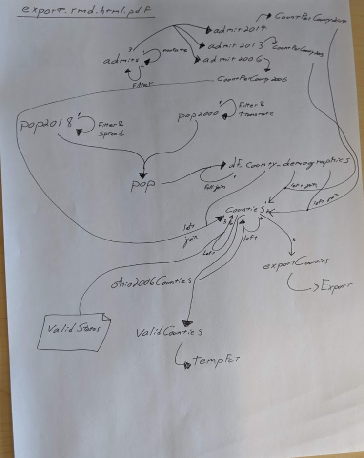

# prison-admissions

U.S. state prison admissions by county, based on an analysis by Josh Keller and Adam Pearce of the New York Times, with assistance from John Pfaff of Fordham University. Used in The New York Times story [This small Indiana county sends more people to prison than San Francisco and Durham, N.C., combined. Why?
](http://www.nytimes.com/2016/09/02/upshot/new-geography-of-prisons.html)

The [National Corrections Reporting Program](http://www.icpsr.umich.edu/icpsrweb/NACJD/series/38/studies/36373?archive=NACJD&sortBy=7) (NCRP) was the primary source for our analysis. We include summary data for calendar years 2006, 2013 and 2014. 

Prison admissions include any new inmates, whether from new court commitments or parole and probation revocations. The NCRP defines a prison admission as:

>Prisoner movements that increased the custody counts of each reporting state. Additions to the custody count, such as the arrival of new inmates, the return to prison of parole violators, and transfers from other jurisdictions, were classified as admission movements. Multiple admissions per person during the year were recorded as separate movements.

Most states send people with sentences of a year or more to prison and people with shorter sentences to jail. (Jail admissions are not included here but exhibit some of the same trends, see [work by the Vera Institute of Justice](http://trends.vera.org/)). Some states, like Massachussets and Texas, send people with longer sentences to jail or people with shorter sentences to prison. We excluded inmates with sentences shorter than one year in North Carolina and South Carolina. The Bureau of Justice Statistics has written a [state-by-state guide](http://ncrp.info/SitePages/StateFactSheets) to prison systems.

The county listed is the location of the court where sentences were imposed, not necessarily the county where the prisoner lived or the county where the inmate was imprisoned.

The data quality in the NCRP has improved markedly, but not all states report reliable data. We reviewed each state's NCRP data and compared its total admissions numbers to the [National Prisoner Statics Program](http://www.bjs.gov/index.cfm?ty=dcdetail&iid=269) (NPS) and, in some cases, data from individual state departments of corrections. State data years with large differences in admissions numbers between NCRP and NPS (greater than 20 percent) were excluded unless the NCRP numbers could be independently validated.

The columns `valid2006`, `valid2013`, `valid2014` describe whether a county had valid data for each year. Invalid data is omitted, and data based on fewer than five prisoners in one county is replaced with 'N/A' in order to respect potential privacy concerns. This means that data for some very low-population counties is not included.

We obtained data for four states – Idaho, Kansas, New Mexico and Ohio (2006 only) – directly from state departments of corrections or sentencing commissions. The source of each row of data is noted in the `source` field.

The `NACJD` folder has the code used to count the number of admissions per county, but The Department of Justice limits access to the full NCRP dataset to those with an approved research exemption. 

## Steve's Notes

It looks like split, compute, and merge here is a way to group by year and county.

